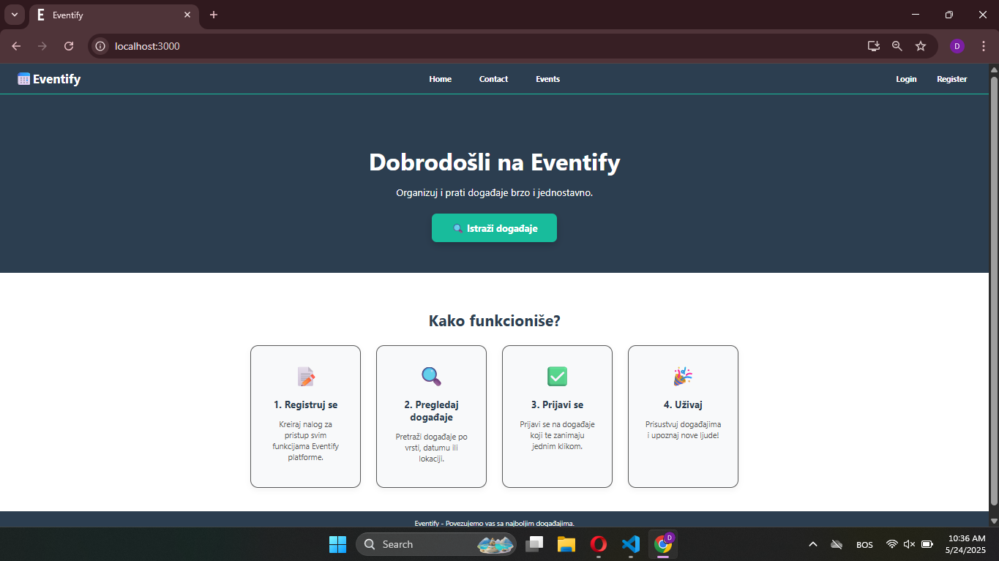
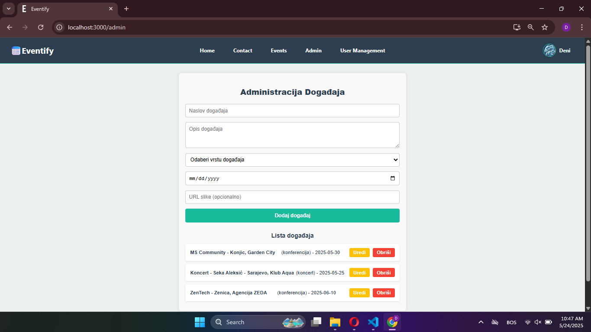

# moj_react
**Projekat-Eventify**

**KRATKI OPIS TEME**

Eventify je web aplikacija koja omogućava pregled, praćenje i organizaciju događaja. Korisnici mogu pregledati dostupne događaje i prijavljivati se na njih, dok administratori imaju pristup funkcijama za dodavanje, uređivanje i brisanje događaja. Aplikacija koristi lokalni JSON Server kao simulaciju baze podataka, čime omogućava osnovne CRUD(create, read, update, delete) operacije bez potrebe za pravim backendom.

**TEHNOLOGIJE KORIŠTENE U RADU**

*Frontend:*
- React (JavaScript)
- React Router DOM
- Axios

*Backend:*
- JSON Server (db.json fajl kao baza podataka)

*Stiliranje:*
- Klasični CSS

*Alati za razvoj:*
- Visual Studio Code
- Node.js
- GitHub

**STRUKTURA PROJEKTA**
dws-main-main/
│
├── public/
│   └── index.html
│
├── src/
│   ├── components/
│   │   ├── Navbar.js
│   │   ├── Footer.js
│   │   └── Modal.js
│   │
│   ├── pages/
│   │   ├── Home.js
│   │   ├── Contact.js
│   │   ├── Events.js
│   │   ├── Login.js
│   │   ├── Register.js
│   │   ├── AdminPanel.js
│   │   ├── Profile.js
│   │   ├── AdminManagement.js
│   │   └── EventRegistration.js
│   │
│   ├── styles/
│   │   ├── Navbar.css
│   │   ├── Footer.css
│   │   ├── Modal.css
│   │   ├── Home.css
│   │   ├── Contact.css
│   │   ├── Events.css
│   │   ├── Login.css
│   │   ├── Register.css
│   │   ├── AdminPanel.css
│   │   ├── Profile.css
│   │   ├── AdminManagement.css
│   │   └── EventRegistration.css
│   │
│   ├── App.js
│   └── index.js
│
├── db.json
├── package.json
└── README.md

**FUNKCIONALNOSTI I OPIS DIZAJNA**

*Funkcionalnosti za korisnike:*
- Pregled svih dostupnih događaja
- Prijava na događaje putem forme
- Registracija i prijava na sistem

*Funkcionalnosti za administratore:*
- Dodavanje novih događaja
- Uređivanje postojećih događaja
- Brisanje događaja
- Upravljanje korisnicima i prijavama

*Dizajn, paleta boja i fontovi*

- Tamna pozadinska boja: #1E1E2F
- Akcentna boja: #FF6B6B
- Sekundarna akcentna boja: #4ECDC4
- Boja teksta: #FFFFFF
- Boja pozadine sekcija: #F7F7F7

- Font: font-family: 'Segoe UI', Tahoma, Geneva, Verdana, sans-serif;

**ULOGE KORISNIKA**

*Administrator*
- Ima pristup "Admin" stranici
- Ima pristup "User Management" stranici
- Može dodavati, mijenjati i brisati događaje
- Može mijenjati uloge korisnika, brisati korisnike i upravljati prijavama

*Registrovani korisnik*
- Može pregledati sve događaje
- Može se prijaviti na događaj
- Pristup kontakt formi

*Neregistrovani korisnik*
- Nema mogućnost prijave na događaje 
- Nema mogućnost slanja poruke putem kontakt forme

**KRATKI OPIS DOPRINOSA SVAKOG ČLANA GRUPE**
*1. član - Fatmir Kurtiši - Frontend*
Ovaj član je bio zadužen za izradu svih stranica u aplikaciji koristeći React (Home, Events, Contact, Login, Register). Također je napravio navigaciju (Navbar i Footer), povezao stranice i prilagodio izgled tako da sve dobro funkcioniše i na mobilnim uređajima.

*2. član - Deni Kosić - Backend (rad sa JSON serverom i podacima)*
Ovaj član je bio zadužen da poveže aplikaciju sa db.json fajlom pomoću fetch metode. Omogućio je spremanje i čitanje podataka za prijavu i registraciju korisnika, kao i za događaje. Također je testirao da sve radi kako treba i dodao osnovnu validaciju.

*3. član - Ahmed Halilović - Dizajn i dokumentacija*
Ovaj član je radio na dizajnu aplikacije – izabrao je boje, stilove i raspored elemenata tako da sve izgleda moderno i pregledno. Također je pisao dokumentaciju projekta, uključujući objašnjenja funkcionalnosti, korištene tehnologije i doprinose svih članova.

**UPUTE ZA POKRETANJE PROJEKTA**
Otvoriti 2 terminala. Prvi terminal služi za pokretanje stranice, a drugi za pokretanje JSON servera.
- Prvi terminal:
npm install
npm start
- Drugi terminal:
npx json-server --watch db.json --port 3001

**SNIMCI EKRANA RADNE APLIKACIJE**

